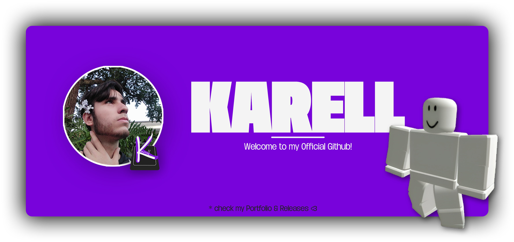

# 👋🏻 Hi there!
> Welcome to my official profile here on Github, if you don't know me or what I do, here is the perfect place where you will find my releases and some projects currently being developed.

# Sections
- [📝 Summary](#📝-summary)
- [👨🏻‍💻 Who I Am](#👨🏻‍💻-what-is-this-profile-for)
- [💎 Stats](#💎-my-stats)
- [💬 Contact](#💬-links--social-medias)

# 📝 Summary
Find on this profile **all my projects** that have been launched and made official, also **follow some ongoing projects in real time**, find **source codes** for some systems **and much more**.

Have access to my social networks and my website, discover what I do in a reliable **and safe way so you can get to know me and hire me**.

# 👨🏻‍💻 What is this profile for?
If you don't know what this profile is for, I can explain it to you in two words: Online CV. That's right, Github is a type of online resume where people from all over the world can create their profiles and show hiring companies their projects and how they are doing in their career.

And that's why this profile exists, **my name is Karell Lutkmeier and I'm a software & website developer**. I'm a Freelancer and I work mainly on the Roblox game development platform, I work with commissions and sales of systems and interfaces.

**I'm a Ui/Ux Designer and Programmer**, if you want to know more about what I do and how to buy one of my systems _(If you want to hire me for a team [**Click Here**](mailto:kareudeveloper@gmail.com))_ you can access my [**Online Portfolio**](https://kareu-uu.carrd.co) and there you will know everything about me.

# 💎 My Stats
*A technical problem is preventing us from accessing this profile's statistics...*
<!--

  

  

!-->

# 💬 Links & Social Medias

  
  
  
  
  

> [**💻 My Portfolio**](https://kareu-uu.carrd.co) - [**✍🏻 My Releases**](https://kareu-uu-releases.carrd.co)
